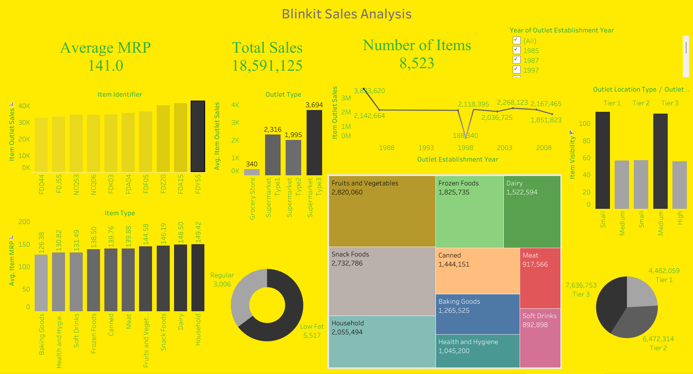

# Blinkit Sales Analysis Dashboard

This project contains a Tableau dashboard for analyzing Blinkit-style grocery sales performance using a retail sales dataset. The dashboard highlights key business metrics such as total sales, average MRP, product category contribution, outlet performance, and sales trends across outlet establishment years.

## Dashboard Preview



## Project Objective

The goal of this analysis is to understand:

- Which product categories generate the highest sales
- How outlet size and outlet type affect revenue
- How sales vary by outlet establishment year
- Which item types contribute the most to total outlet sales

## Dataset

The analysis uses the file:

- [1759922330444-Grocery_Store.csv](1759922330444-Grocery_Store.csv)

The dataset includes columns such as:

- Item_Identifier
- Item_Weight
- Item_Fat_Content
- Item_Visibility
- Item_Type
- Item_MRP
- Outlet_Identifier
- Outlet_Establishment_Year
- Outlet_Size
- Outlet_Location_Type
- Outlet_Type
- Item_Outlet_Sales

## Tableau Workbook

- [blinkit sales analysis.twbx](blinkit%20sales%20analysis.twbx)

This workbook contains all dashboard visualizations and KPI summaries for the sales analysis.

## Key Insights from the Dashboard

The dashboard presents the following high-level metrics:

- Average MRP: 141.0
- Total Sales: 18,591,125
- Number of Items: 8,523

Major sales trends observed:

- Fruits and Vegetables are among the top-performing categories.
- Supermarket Type 1 and other major outlet formats show strong sales contribution.
- Sales performance varies by outlets established in different years.
- Category-wise and outlet-wise product mix influence overall revenue significantly.

## File Structure

```text
Blinkit/
├── README.md
├── Blinkit_dashboard-preview.png
├── 1759922330444-Grocery_Store.csv
├── blinkit sales analysis.twbx
└── .gitignore (if added later)
```

## Tools Used

- Tableau
- CSV data analysis
- Dashboard visualization
- GitHub for project sharing and version control

## How to Use

1. Open the Tableau workbook file in Tableau Desktop.
2. Review the dashboard sheets and KPI tiles.
3. Explore filters and charts to analyze sales by category, outlet, and year.
4. Use the CSV dataset for further analysis in Excel, Python, or Power BI if needed.

## GitHub Ready Summary

This repository is prepared as a data analytics portfolio project and can be pushed to GitHub for showcasing skills in:

- Data visualization
- Dashboard storytelling
- Retail sales analysis
- Tableau reporting

## License

This project is intended for educational and portfolio use.
